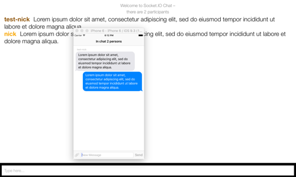

# Chat-SocketIO
Chat using basic server example https://github.com/socketio/socket.io/tree/master/examples/chat

To test chat u need:

1. Follow instruction https://github.com/socketio/socket.io/tree/master/examples/chat to run server
2. Write down your IP in **class SocketIOManager** at line 33
```
var socket = SocketIOClient(socketURL: NSURL(string: "http://192.168.1.2:3000")!)
```
3. Start the app


